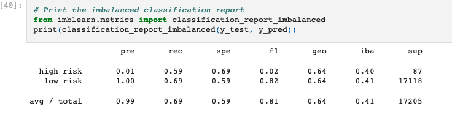
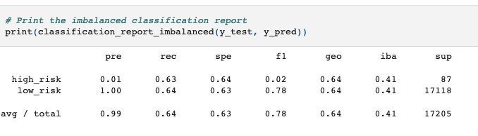
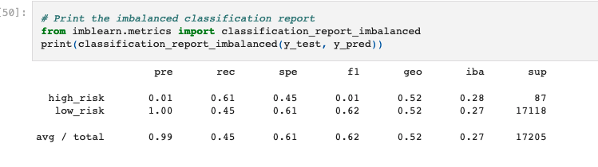
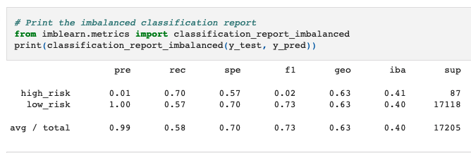
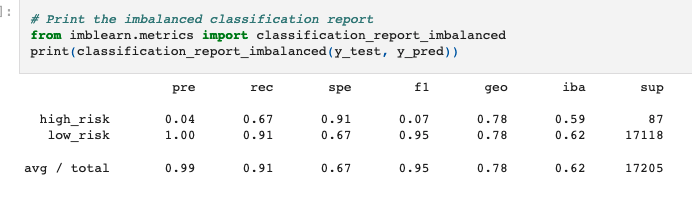
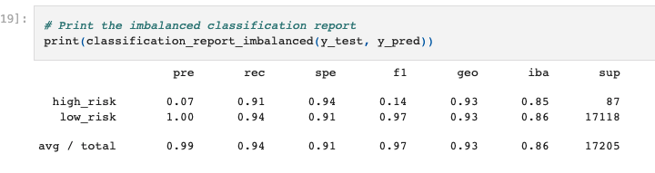

# Credit_Risk_Analysis
## Overview of the loan prediction risk analysis:
Credit risk is an inherently unbalanced classification problem, as good loans easily outnumber risky loans. Different techniques were used to train and evaluate models with unbalanced classes. Various libraries and algorithms were used to build and evaluate models using resampling including:

1. imbalanced-learn
2. scikit-learn
3. RandomOverSampler
4. SMOTE algorithms
5. ClusterCentroids algorithm
6. SMOTEENN algorithm
7. BalancedRandomForestClassifier (bias reduction model)
8. EasyEnsembleClassifier (bias reduction model)

## Purpose:
- Explain how a machine learning algorithm is used in data analytics.
- Create training and test groups from a given data set.
- Implement the logistic regression, decision tree, random forest, and support vector machine algorithms.
- Interpret the results of the logistic regression, decision tree, random forest, and support vector machine algorithms.
- Compare the advantages and disadvantages of each supervised learning algorithm.
- Determine which supervised learning algorithm is best used for a given data set or scenario.
- Use ensemble and resampling techniques to improve model performance.

## Results:
The results for the six machine learning models including their respective balanced accuracy, precision, and recall scores are as follows:

## Naive Random Oversampling

- Balanced Accuracy: 0.640544738146174
- Precision: The precision is low for High-risk loans and is high for Low-risk loans.
- Recall: High/Low risk = .59/.69

## SMOTE Oversampling

- Balanced Accuracy: 0.6369822449448252
- Precision: The precision is low for High-risk loans and is high for Low-risk loans.
- Recall: High/Low risk = .63/.64

## Undersampling

- Balanced Accuracy: 0.6369822449448252
- Precision: The precision is low for High-risk loans and is high for Low-risk loans.
- Recall: High/Low risk = .61/.45

## Combination Under-Over Sampling

- Balanced Accuracy: 0.5291858539710166
- Precision: The precision is low for High-risk loans and is high for Low-risk loans.
- Recall: High/Low risk = .70/.57

## Balanced Random Forest Classifier

- Balanced Accuracy: 0.7877672625306695
- Precision: The precision is low for High-risk loans and is high for Low-risk loans.
- Recall: High/Low risk = .67/.91

## Easy Ensemble AdaBoost Classifier

- Balanced Accuracy: 0.925427358175101
- Precision: The precision is 0.1 for High-risk loans and is 1 for Low-risk loans.
- Recall: High/Low risk = .91/.94

## Summary:
- The ADA boost algorithm is recommended over all the other algorithms with a balanced accuracy of 0.925427358175101 which is closest to 1 when compared to all other models.

- Also, the precision for high-risk class is the highest at 0.1 compared to all other models which are 0.

- Recall scores which is the measure that correctly identifies True Positives is the highest and closest to 1 for both high-risk and low-risk.